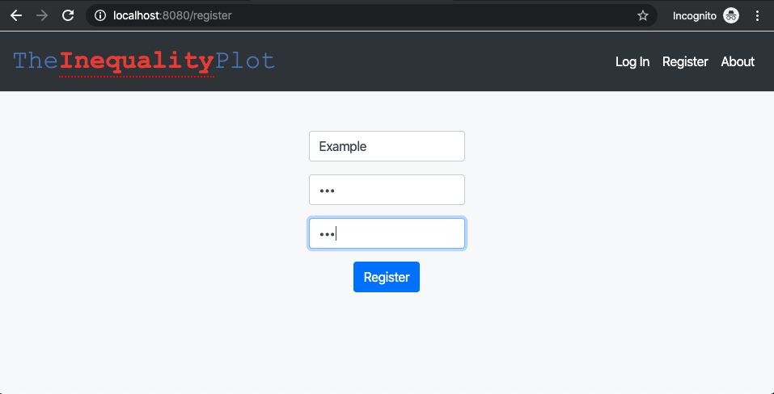
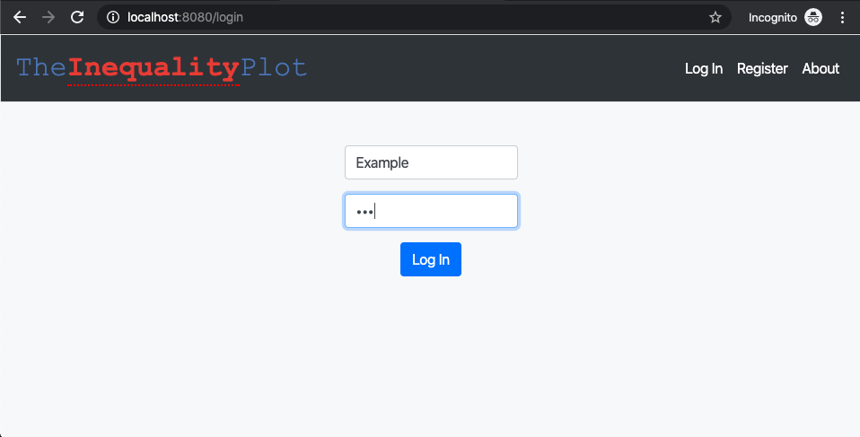
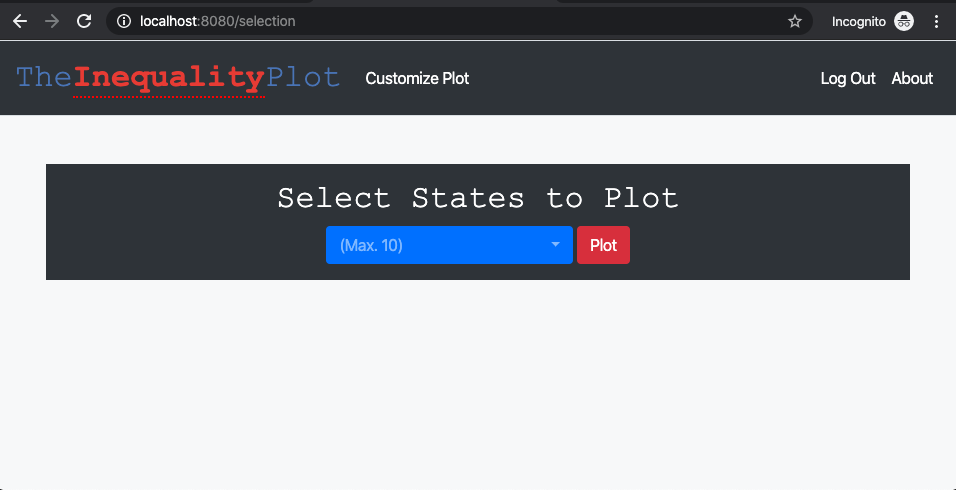
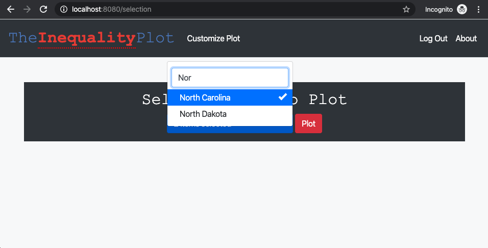
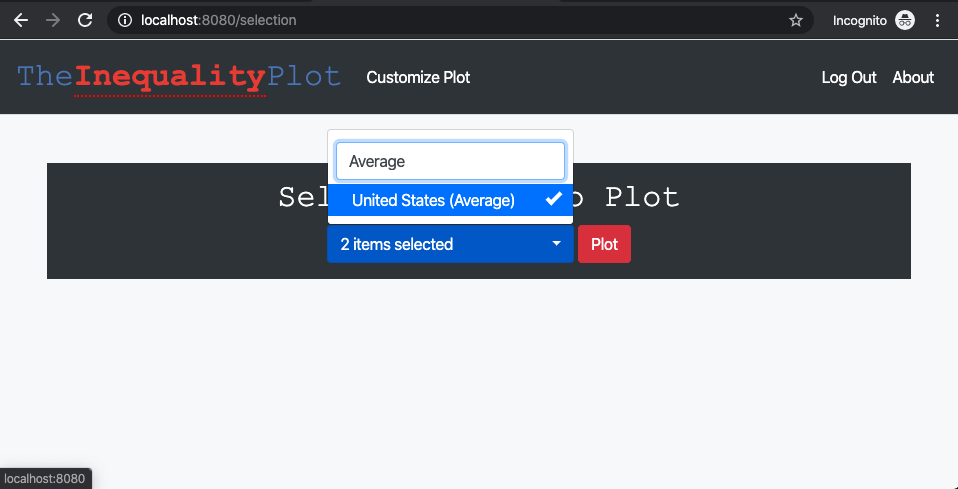
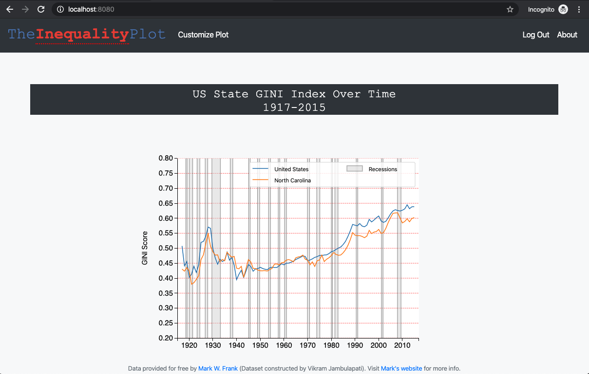
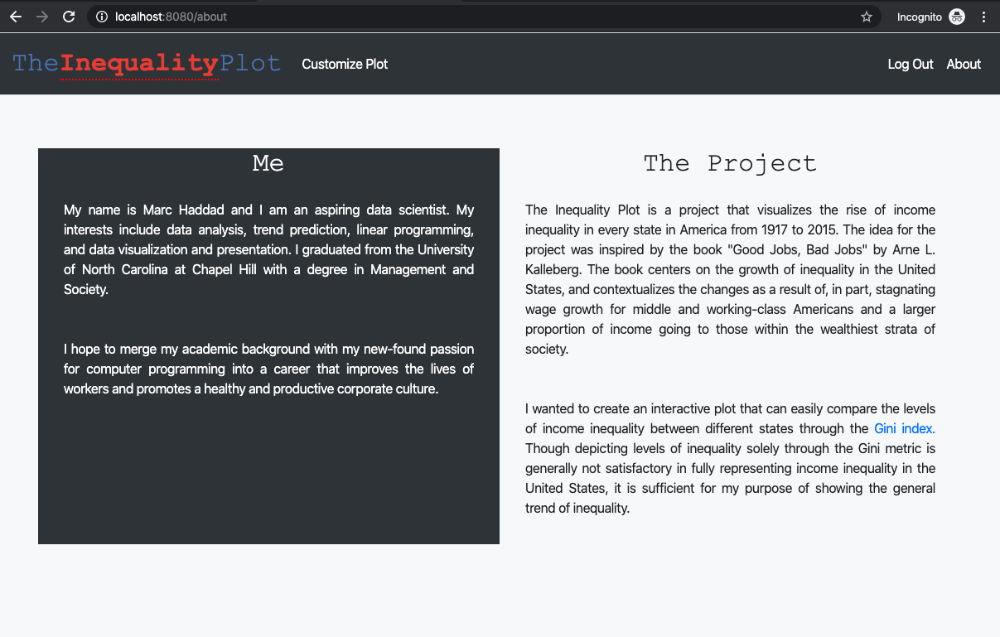

# Folders for the Inequality Plot Project

### Initial Plot Script
Contains the initial python template to be converted to a web app.

### Final Web App
Contains the final project.

# Final Web App Walkthrough

## Initial landing page

## Registration page

## Login after username and password creation

## Selection page prompting users to select up to 10 US States

## Custom search capability

## Average of all States included

## Custom plot display

## 'About' page

